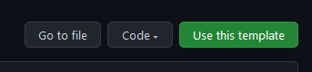

# NexTSass
Matteu's NextJS, React, Sass, and Typescript starter template.

Yes I know the acronym sucks, but this stack is pretty OP for my use cases.

## Features
- SASS (Preprocessor)
- Sentro + Himig Web (Styling)
- Formik (Forms)
- React Icons (Icons)
- ESLint (Formatting)

## Usage
Use this repo as a template.



Clone the repo you've made from the template
```shell
git clone https://github.com/MyUser/my-repo-name
```

For dev servers:
```shell
npm run dev

or 

yarn dev
```

For prod servers:
- Just deploy it to vercel or netlify. Really up to you :)